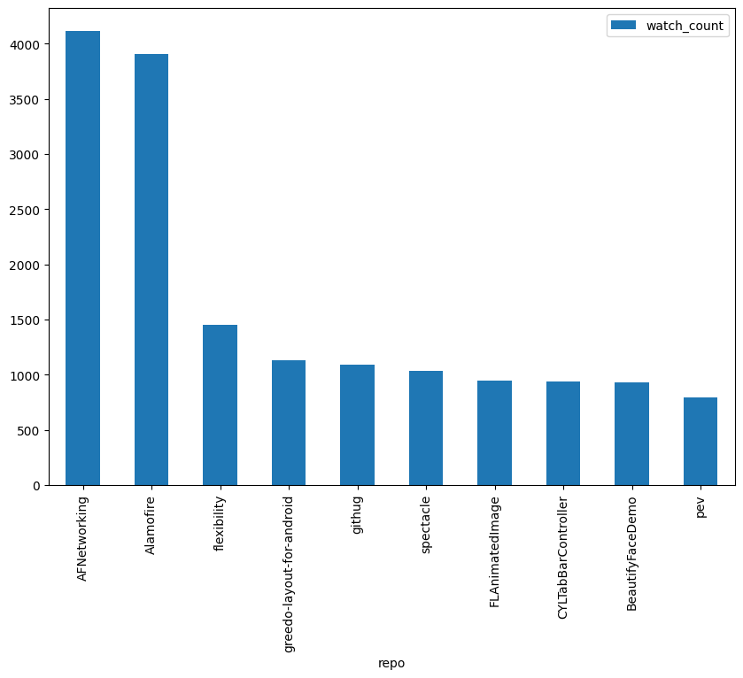
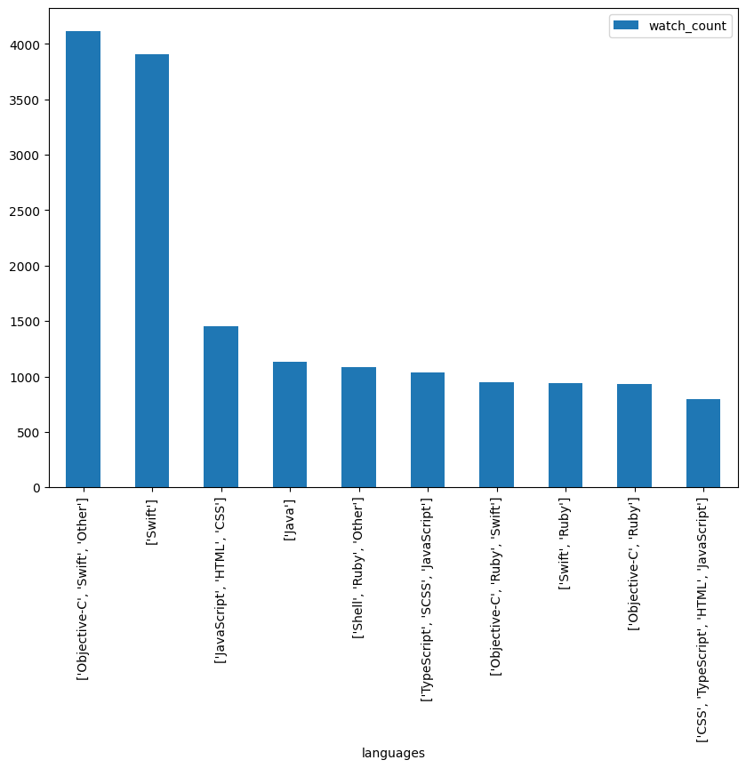

# Dataset extraction from GoogleCloud BigQuery

In this notebooks we explained the way we connect to the GoogleCloud BigQuery server to access de public data from big query datasets.
We get the github_repos database that contains data from over 3 million repositories from github.

Finally, we extract a sample of the big query dataset and preprocessed it.

## Dataset info on Kaggle
You can find more info about the [dataset on Kaggle](https://www.kaggle.com/code/poonaml/analyzing-3-million-github-repos-using-bigquery) and Gooogle Cloud BigQuery.

## Dataset info on Google Cloud
The origin of the [dataset](https://console.cloud.google.com/bigquery?p=bigquery-public-data&d=github_repos&page=dataset&project=fourth-carport-349318&ws=!1m4!1m3!3m2!1sbigquery-public-data!2sgithub_repos) is located on the public data from Google Clod Big Query

## Import the dataset
Kaggle has a notebook test example of the data extraction through the SohierDane's python library [BigQueryHelper](https://www.kaggle.com/code/ricardojaram/safely-analyzing-github-projects-popular-l-0350da/edit). A library that makes easier the access to big query, although you need the ADC Credencials from Google Cloud CLI.

Download the [CLI from Google Cloud](https://cloud.google.com/sdk/docs/install?hl=es-419) and create some credentials to use direcly big query on Python with the [Python SDK Google Cloud](https://cloud.google.com/python/docs/reference/storage/latest).

After setting the credentials you'll need to config the client SDK from google cloud and adapt an IAM Google account to manage an enough quota of bytes/requests the the API.

Since we only could make some requests from kaggle's kernels and can't afford pay credits to GCP, we up to work diretly in [BigQuery](https://console.cloud.google.com/bigquery?p=bigquery-public-data&d=github_repos&page=dataset&project=fourth-carport-349318&ws=!1m4!1m3!3m2!1sbigquery-public-data!2sgithub_repos) and download a sample of the next datasets:

```
SELECT * FROM `bigquery-public-data.github_repos.commits` LIMIT 10
SELECT * FROM `bigquery-public-data.github_repos.licenses` LIMIT 10
SELECT * FROM `bigquery-public-data.github_repos.sample_commits` LIMIT 10
SELECT * FROM `bigquery-public-data.github_repos.sample_repos` LIMIT 10
```
> **Note:** We limit the query to 10 rows for explanation. The dataset used over 200,000 records and then sample again up to 15,000 records ready to use.

## Preprocess the data
After downloading the dataset we applied some joins and drop columns. We save a dataframe in a csv file to import in our GitSoft Engine proyect.

Here's some charts of the kind of data we'll (this was taken from a **SAMPLE** of the whole dataset):

### Top 10 repos per watchers


### Top 10 authors per watchers


### Top 10 authors per watchers


### Top 10 list of languages used in a repo per watchers
